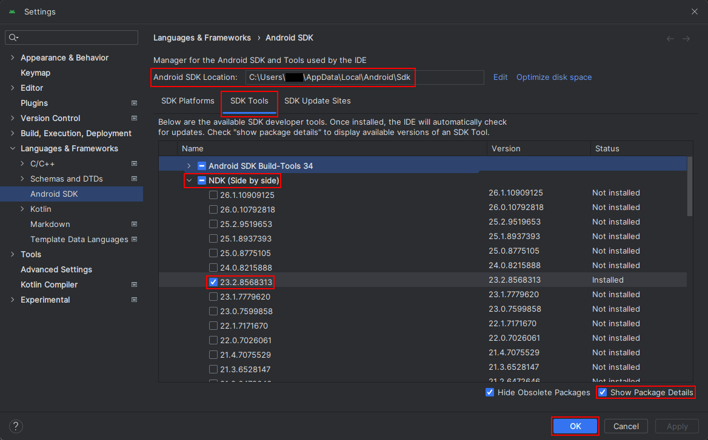

# Moonlight Android

[](https://ci.appveyor.com/project/cgutman/moonlight-android/branch/master)
[](https://hosted.weblate.org/projects/moonlight/moonlight-android/)

[Moonlight](https://moonlight-stream.org/) for Android is an open source client for
[Nvidia GameStream](https://www.nvidia.com/en-us/support/gamestream/) and
[Sunshine](https://github.com/LizardByte/Sunshine).

Moonlight for Android will allow you to stream your full collection of games from your computer to
your Android device, whether in your own home or over the internet.

Moonlight also has clients for [PC](https://github.com/moonlight-stream/moonlight-qt),
[iOS/tvOS](https://github.com/moonlight-stream/moonlight-ios), and
[more](https://moonlight-stream.org/).

You can follow development on our [Discord server](https://moonlight-stream.org/discord)
and help translate Moonlight into your language on
[Weblate](https://hosted.weblate.org/projects/moonlight/moonlight-android/).

## Download

* [Google Play Store](https://play.google.com/store/apps/details?id=com.limelight)
* [Amazon App Store](https://www.amazon.com/gp/product/B00JK4MFN2)
* [F-Droid](https://f-droid.org/packages/com.limelight)
* [APK](https://github.com/moonlight-stream/moonlight-android/releases)

## Build

1. Install [Android Studio](https://developer.android.com/studio)
1. Install the Android NDK 
   1. In Android Studio, open _Tools»SDK Manager_
   1. Note the _Android SDK Location_ for later
   1. Click the _SDK Tools_ tab
   1. Enable the _Show Package Details_ checkbox in the bottom-right
   1. Expand the _NDK (Side by side)_ category
   1. Check the version that corresponds to the [version found in `app/build.gradle`](app/build.gradle#L4)
   1. Click OK
1. In `moonlight-android/`, create a file called `local.properties`
   1. Add the following contents, edited to reference your actual paths on disk.
      Note the extra backslashes!
      ```
      sdk.dir=C\:\\Users\\USERNAME\\AppData\\Local\\Android\\Sdk
      ndk.dir=C\:\\Users\\USERNAME\\AppData\\Local\\Android\\Sdk\\ndk\\VERSION
      ```
1. Run `git submodule update --init --recursive` from within [`moonlight-android/`](/)
1. Build the APK using Android Studio or Gradle

## Authors

* [Cameron Gutman](https://github.com/cgutman)  
* [Diego Waxemberg](https://github.com/dwaxemberg)  
* [Aaron Neyer](https://github.com/Aaronneyer)  
* [Andrew Hennessy](https://github.com/yetanothername)

Moonlight is the work of students at [Case Western](http://case.edu) and was started as a project at
[MHacks](http://mhacks.org).
